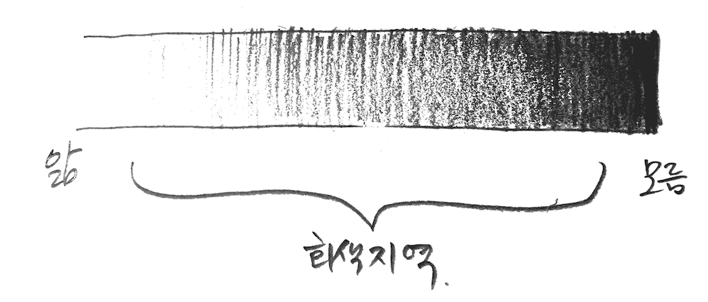

## 수업의 팁
이번 학기 전공실습 수업으로 Nature of Code(이하 NoC)를 진행하면서 다음과 같은 시도들을 하고 있습니다.

학생들에게는 수업에서 시도되는 방법들에 대해 그 의미를 이해하는데 도움이 되고자,
비슷한 강의를 진행하는 다른 교수자분들에게는 경험의 공유와 참고가 될 수 있도록 메모를 남깁니다.

### 부분적인 역진행 수업 (Flipped Learning)
다음 시간에 배울 내용에 대해 관련 동영상 수업을 [과제](homework.md)로 내줍니다.
학생들은 동영상 수업을 듣고 그 과정에 대해 저널링을 합니다.
수업에서는 동영상 강의의 설명으로도 부족한 부분을 다른 여러 방식으로 재설명해주고, 관련 연습을 합니다.

 * NoC를 집필한 대니얼 쉬프만의 동영상 강의를 적극적으로 사용하고 있습니다.
   * Kadenze의 Nature of Code수업과 Youtube Coding Train이 있습니다.
   * 저자의 훌륭한 강의가 공개되어 있다는 것은 학습자에게 정말 축복입니다.
   * 상호작용이 적은 동영상 강의의 부족한 점을 교수자인 저는 **코치** 의 태도로 보완하고 있습니다.
 * 과제의 내용은 다음 수업을 위한 준비가 됩니다.
   * 그래서 아직 배우지 않은 내용이 나오고, 이는 과제를 수행하기 어렵게 만들기도 합니다.
   * '모르는 것'을 인식하는 상태에 대해서 불편하지 않도록 돕습니다.
   * 즉, 내용을 이해하는게 과제의 목표가 아니라, **'모르는 부분을 찾고, 궁금해하는게'** 과제의 목표입니다.

### 저널링 과제
학생들은 과제를 진행하는 과정에서 저널링을 남깁니다.
특정 형식을 강요하지는 않고 과제의 과정과 회고를 남기도록 하는데, 다음 내용은 포함이 되도록 권장하고 있습니다.

 * 무엇을 했는지 / 어떤걸 시도했는지 (사실)
 * 어떤 느낌인지 / 어려운 점은? (감정)
 * 새롭게 배운 것은 무엇인지

동영상 강의를 미리 공부해오는 과제는 다음 수업을 위해서 매우 중요하지만, 영어로 진행되는 생소한 내용의 강의는 분명 큰 장벽이 존재합니다.
그래서 강의 내용을 모두 이해하려는 부담감을 줄이고, 그 과정에서 발생하는 자기 자신의 변화를 인식할 수 있도록 저널링을 남기는게 주된 과제의 내용입니다.

 * 저널링의 내용을 읽으면서 교수자는 각 학생들이 느끼는 어려움이나 생각의 흐름을 부분적으로 미리 읽어보고 수업을 준비하는 데 도움을 얻을 수 있습니다.
 * 여기서 중요한건 저널링을 단순히 내용을 채워서 교수자에게 보여줘야하는 '과제로써의 저널링'이 되지 않도록 학생들과의 공감대를 만들어가야 합니다.
   * '일기 쓰기'가 삶에 매우 긍정적인 효과가 있지만, 어린 학창시절의 과제였던 일기는 그 진정한 목적이 제대로 달성되지 않지요.

### 짝 과제 확인
과제가 다음 수업을 준비하기 위한 중요한 과정이므로, 학생들이 과제를 제 때 진행할 수 있도록 독려해야합니다.
처음에 시도된 방법으로는 수업 마지막에 과제를 설명하면서 각자가 과제를 진행할 일정을 미리 잡아보고,
해당 일에 서로의 짝이 확인하고 격려하는 문자를 보내주도록 해봤습니다.

 * 여러 수업을 동시에 듣고, 학업 외 바쁜 학창시절도 보내야하는 학생들에게 과제는 부담이 됩니다.
 * 수업 중에는 과제에 대한 의욕이 생기더라도, 수업이 끝나면 한없이 미루기 일쑤고, 보통 과제는 마감일에 집중하게 됩니다.

 * 강제성을 가진 것은 아니기에, 이 방법을 통해 '과제 미루기'가 마법처럼 해결되지는 않습니다.
 * 이 방법 외에도 학생들이 과제를 할 때 벼락치기가 아니라 스스로 일정을 잡고, 지켜갈 수 있는 근육을 기르는 방법을 계속 고민해볼 생각입니다.

### 회색 지역 찾기
어떤 지식에 대해서 알고/모름이 이분법적으로 딱 떨어지진 않습니다. 지식의 이해를 명암으로 구분할 때 여러 스펙트럼의 회색지대가 존재합니다.

새로운 지식을 습득하려고 할 때, 처음부터 깜깜한 지대를 밝히려고 하기 보다는 내 앎의 언저리에 있는 밝은 회색지역부터 접근할 필요가 있습니다.
학생들과 이야기할 때에는 **아리까리한 내용** 이라고 말하기도 합니다.

과제와 저널링을 하면서 새로운 지식 영역 안에서 명/회색/암을 인지하고, 수업 시간에는 어두운 부분을 조금 더 밝은 영역으로 옮길 수 있는 코칭을 합니다.

### 라이브 코딩

### 겹쳐진 수업과정

### 학생 코드 읽기 + 라이브 코딩
